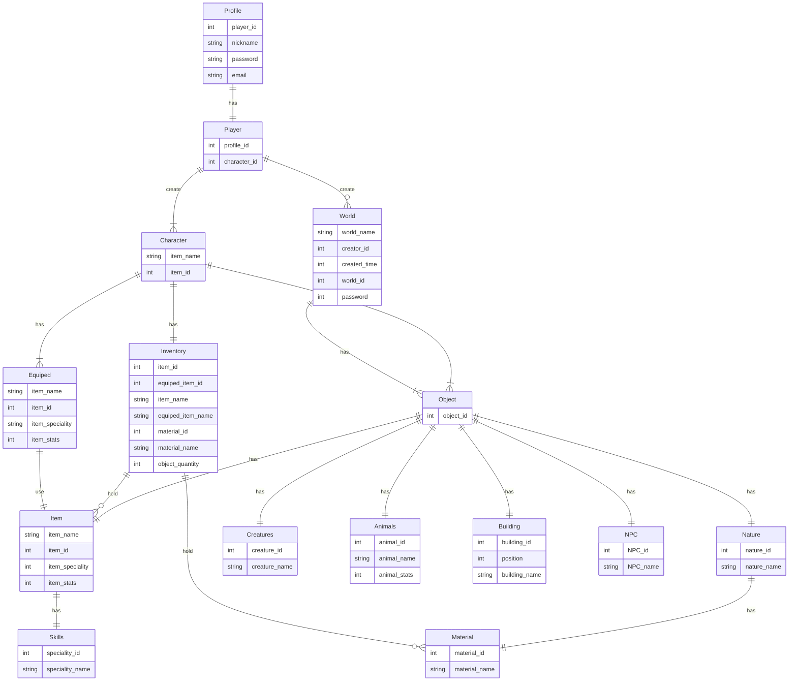
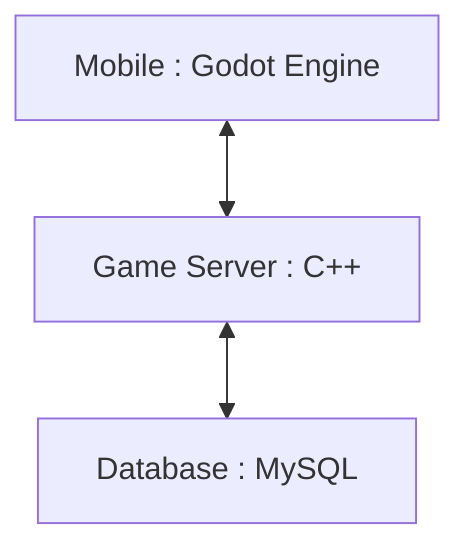

# Membuat game survival casual (mudah) yang bertemakan Nusantara

## 1.1 Latar Belakang
Game dengan genre survival akhir-akhir ini menjadi sebuah trend yang banyal diminati oleh semua kalangan. Gameplay bertahan hidup dan eksplorasi dunia yang luas menjadi identitas utama pada game bergenre survival. Hadirnya game Minecraft dari publisher mojang menjadi permulaan dimulainya survival sandbox lebih dikenal banyak orang. Memiliki segudang mekanik yang membuat kreatifitas para playernya tak terbatas. Game besar lainnya yang bergenre sama dengan minecraft diantaranya ada Ark, Terraria, The Forrest, V Rising, Subnautica, Rafft, dan game lainnya.
Dengan banyaknya fans dari game survival, Puaka hadir dengan maksud memperkenalkan budaya Indonesia. Puaka Bertemakan Nusantara, dimana ornamen dalam game mengandung unsur-unsur budaya Indonesia di dalamnya, serta makhluk-makhluk yang menghuni dunia Puaka terinspirasi dari makhluk yang ada di Indonesia.

## 1.2 Deskripsi Teknologi Informasi
Puaka merupkan sebuah game bergenre survival yang memiliki tema Nusantara. Game ini dibuat menggunakan engine Godot 4 dengan bahasa GDScript. Puaka memiliki gameplay yang lebih casual (mudah) dan memiliki tone game yang ringan, serta memiliki beberapa core mechanic seperti game survival lainnya (bertahan hidup, membangun base, dan lain-lain).  
Puaka diambil dari bahasa Melayu yang merujuk pada dedemit atau makhluk ghaib. Karena, seluruh monster pada dunia game ini akan berisikan makhluk-makhluk halus yang ada di Indonesia seperti, tuyul, banas pati, dan kawan-kawan. Dunia pada game ini disebut Zamin yang memiliki arti tanah atau negeri, juga diambil dari bahasa Melayu. Dunia zamin akan berlatarkan Nusantara, akan banyak ornamen-ornamen yang bertemakan Nusantara. Tema yang dibawakan game ini yaitu Nusantara. Jadi, akan banyak sekali makhluk-makhluk gaib, latar yang memiliki ornamen Nusantara, dan mengambil beberapa cerita rakyat(folks lore) sebagai latar cerita game ini.


## 1.3. Branding

-	Merk		: Puaka
-	Tagline		: "Un-Bhinneka"
-Campaign 	: Memperkenalkan bagian dari budaya Indonesia melalui media game khususnya pada makhluk-makhluk halus yang ada di Indonesia, dengan latar belakang ceritanya masing-masing.
- Target user :
  -	Usia 10+
  - Orang yang gemar dengan makhluk halus
  -	Penggemar game survival RPG seperti minecraft dan ga
  -	Orang yang ingin bermain survival dengan pace yang lebih santai dan tidak terlalu grinding
-	User experience theme :
    -	Santai
    - Ramah untuk keluarga
    - Gameplay yang mudah dipahami
- Referensi desain UI/UX :
  
  


## 2. User Story
Sebagai	| Saya ingin bisa |	Sehingga	| Prioritas
---|---|---|---
Pemain	| Bertahan hidup di dunia Zamin yang berbahaya	| Bisa bermain lebih lama	| ⭐⭐⭐⭐⭐
Pemain |	Mengeksplorasi dunia Zamin	| Menguak mister di dunia zamin |	⭐⭐⭐⭐⭐
Pemain	| Memiliki side-kick yang berupa NPC maupun monster | Dapat mempermudah dalam hal eksplorasi maupun bertarung | ⭐⭐⭐⭐
Pemain	| Bertarung dengan monster | 	Memenangkan berbagai material untuk crafting |	⭐⭐⭐⭐⭐
Pemain	| Membuat base | Mempunyai tempat untuk berlindung dan tempat untuk istirahat |	⭐⭐⭐⭐⭐
Pemain	| Pertarungan melawan boss yang menantang | Salah satu cara untuk membuktikan kekuatan dan seberapa jago seorang player | ⭐⭐⭐⭐
Pemain	| Berinteraksi dengan rakyat zamin(NPC)	| Lebih mengenal latar belakang dunia zamin | ⭐⭐⭐
Pemain	| Mendapatkan ending yang bercabang | Mempunyai replaybility yang panjang | ⭐⭐⭐
Pemain	| Menikah dengan NPC favorit  | Bisa lebih mengapresiasi terhadap NPC yang difavoritkan | ⭐⭐⭐⭐️
Pemain	| Kustomisasi karakter yang sangat bebas | MC pada game memiliki persona yang sama dengan pemain | ⭐⭐⭐
Pemain	| Mendapatkan cuaca dan musim yang berbeda-beda | Bisa mendapatkan suasana yang berbeda setiap saatnya dan merasakan dunia yang lebih imersif | ⭐⭐⭐⭐
Pemain	| Bermain secara online | Pengalaman bermain lebih seru karena bertemu berbagai player di seluruh dunia | ⭐⭐⭐
Pemain	| Membentuk aliansi dengan player lain | Dapat membangun aliansi hingga menjadi sebuah kerajaan sendiri | ⭐⭐⭐⭐
Pemain	| Melakukan trading baik secara online maupun offline | Menjadi salah satu sumber untuk mencari uang | ⭐⭐⭐⭐


## 3. Struktur Data	


## 4. Arsitektur Sistem

## 5. Teknologi, Library, dan Framework
Godot Engine 4 dengan bahasa GDScript.
```
extends CharacterBody2D

var speed = 90  

var player_state

func _physics_process(delta):
	var direction = Input.get_vector("left", "right", "up", "down")
	
	if direction.x == 0 and direction.y == 0 :
		player_state = "idle"
	
	elif direction.x != 0 or direction.y != 0 :
		player_state = "walk" 
		
	velocity = direction * speed
	move_and_slide()

	play_anim(direction)

func play_anim(dir) :
	
 if player_state == "idle" :
		
  $AnimatedSprite2D.play("idle")
	
 if player_state == "walk" :
		
  if dir.y == -1 :
			
   $AnimatedSprite2D.play("n-walk")
		
  if dir.y == 1 :
		
   $AnimatedSprite2D.play("s-walk")	
		
  if dir.x == -1 :
		
   $AnimatedSprite2D.play("w-walk")
		
  if dir.x == 1 :
		
   $AnimatedSprite2D.play("e-walk")	
```

## 6. Desain UI/UX


